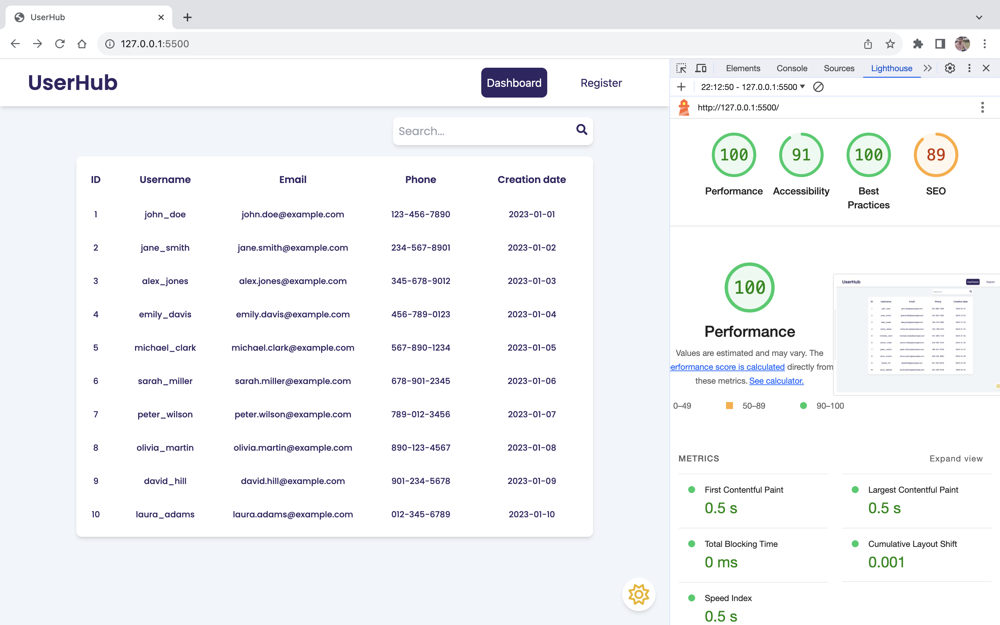

# Project Setup Guide

Welcome to the project! This guide will help you set up and run the application locally on your machine.

## Prerequisites

Before you get started, ensure that you have the following installed on your machine:

- **Node.js:** [Download and Install Node.js](https://nodejs.org/)


## Steps to Set Up the Project

1. **Clone the Repository:**
   ```bash
   git clone https://github.com/Shubham4f/user-hub.git
   cd user-hub
2. **Open a terminal in the project folder and run the following command:**
   ```bash
   npm install
3. **After installing project dependencies, run the following command to starts the JSON server:**
    ```bash
    npx json-server --watch db.json
4. **Open another terminal and run the following command to start the development server:**
    ```bash
    npm run dev
5. **Now, you should have the project running locally on your machine.**

## Lighthouse Score for the Build Version

- **Performance:** 100
- **Accessibility:** 91
- **Best Practices:** 100
- **SEO:** 89
> **Note:** The scores provided above are specifically for the ***build version*** of the project.

 